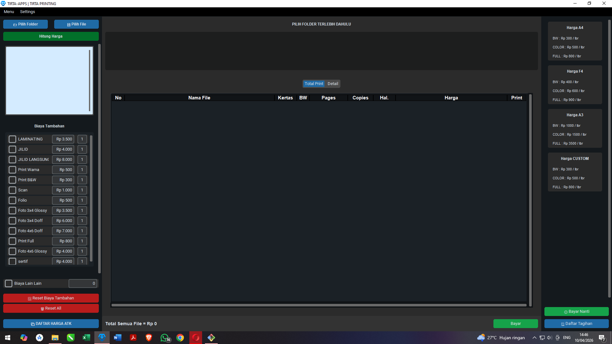
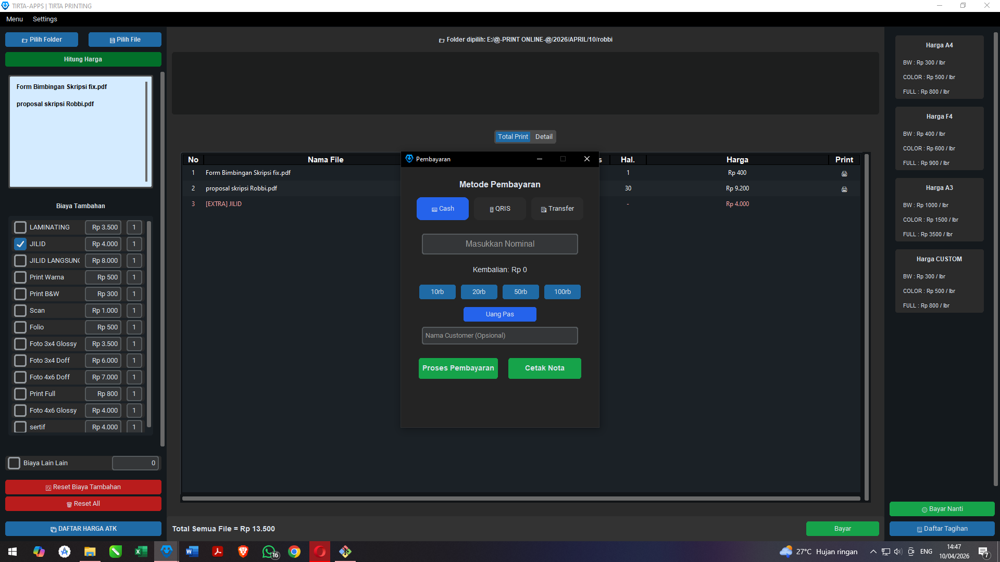
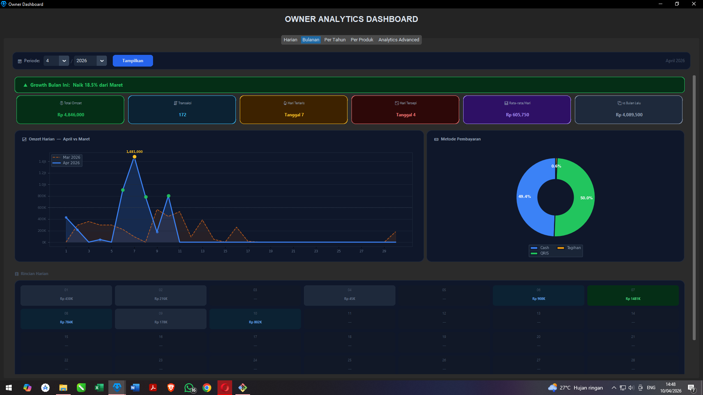
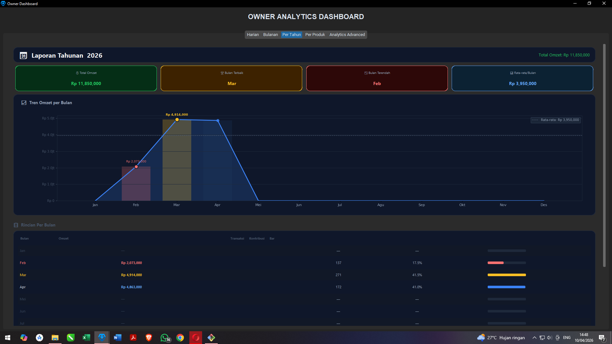
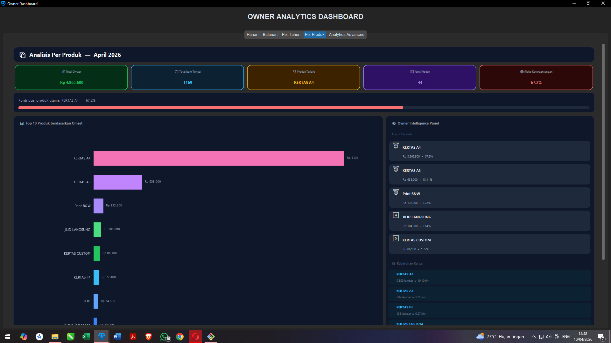
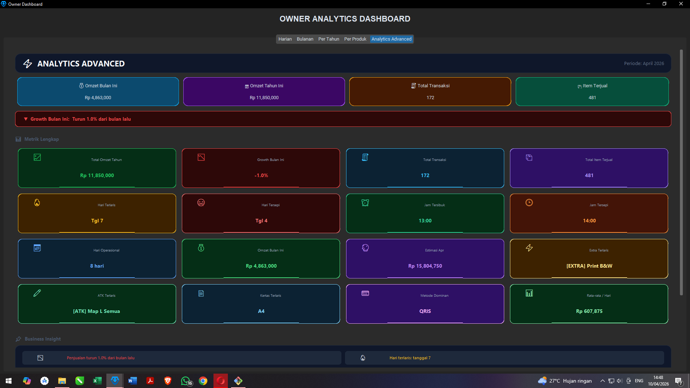

Siap, ini sudah dalam format **README.md bersih (tinggal copy–paste langsung)** 👇

---

# 🚀 TIRTA-APPS

### Modern POS System for Printing & UMKM Business

> Solusi kasir profesional, cepat, dan **offline-first** untuk usaha percetakan, ATK, dan UMKM.

---

## ✨ Preview Aplikasi

### 📊 Dashboard

### 💳 Transaksi

### 📅 Laporan Bulanan

### 📈 Laporan Tahunan

### 📦 Analisis Produk

### ⚡ Analytics Advanced

---

## 💼 Tentang Aplikasi

**TIRTA-APPS** adalah aplikasi kasir (**Point of Sale**) berbasis desktop yang dirancang khusus untuk kebutuhan UMKM di Indonesia.

Dibangun dengan fokus pada:

* ⚡ Kecepatan transaksi
* 🧾 Kemudahan penggunaan kasir
* 📊 Insight untuk owner
* 🔌 Full offline (tanpa internet)

---

## 🔥 Fitur Unggulan

### 💳 Sistem Pembayaran Lengkap

* Tunai (Cash)
* QRIS
* Transfer
* Kembalian otomatis
* Tombol cepat: **Uang Pas & Quick Cash**

---

### 🧾 Nota & Struk Profesional

* Cetak thermal printer (USB & Bluetooth)
* Preview sebelum print
* Re-print transaksi
* Nama customer di nota
* Status pembayaran:

  * ✅ Lunas
  * ⏳ Belum Lunas

---

### 📊 Dashboard & Analytics (Owner Mode)

* Laporan Harian, Bulanan, Tahunan
* Grafik penjualan (Line, Bar, Pie)
* Produk terlaris
* Metode pembayaran dominan
* Jam & hari paling ramai
* Insight bisnis otomatis

---

### 📁 Manajemen Data

* Penyimpanan lokal (JSON)
* Cepat & ringan
* Tidak perlu server / internet
* Aman untuk UMKM

---

### 📤 Export & Reporting

* Export ke **PDF**
* Export ke **Excel**
* Preview sebelum export
* Siap untuk laporan bisnis

---

## 🖥️ System Requirements

| Komponen | Minimum    | Rekomendasi     |
| -------- | ---------- | --------------- |
| OS       | Windows 10 | Windows 11      |
| RAM      | 4 GB       | 8 GB            |
| Storage  | 200 MB     | 500 MB          |
| Printer  | Optional   | Thermal Printer |

---

## ⚙️ Instalasi

1. Jalankan file:
   TirtaApps_Setup.exe

2. Ikuti proses instalasi

3. Buka aplikasi dari Desktop

---

## 🔧 Setup Awal

* Atur printer thermal
* Isi nama usaha
* Sesuaikan format nota

---

## 🔐 Sistem Lisensi

* 🔑 Sekali beli (Lifetime License)
* 💻 Berlaku untuk 1 perangkat
* 🔄 Aktivasi ulang jika pindah device

---

## 🛠️ Teknologi

* Python 3
* CustomTkinter (Modern UI)
* Matplotlib (Chart & Analytics)
* JSON (Local Database)
* ESC/POS (Thermal Printing)

---

## 💡 Keunggulan Dibanding POS Lain

| TIRTA-APPS       | POS Online          |
| ---------------- | ------------------- |
| ✅ Offline        | ❌ Butuh internet    |
| ✅ Sekali bayar   | ❌ Berlangganan      |
| ✅ Cepat & ringan | ❌ Bergantung server |
| ✅ Fokus UMKM     | ❌ Umum              |

---

## 📈 Cocok Untuk

* Percetakan
* Fotocopy & Laminating
* Toko ATK
* UMKM retail kecil

---

## 🧑‍💻 Developer

**Fazzy**
Software Developer – POS & UMKM Systems

---

## 📞 Support & Custom

Butuh fitur tambahan atau custom?
Hub : 085335015609

* 🛠️ Custom fitur sesuai bisnis
* 🔄 Update & maintenance
* 📊 Upgrade dashboard analytics

---

## ⭐ Roadmap

* [ ] Multi-device sync (LAN / Cloud optional)
* [ ] Mobile companion app
* [ ] Backup otomatis
* [ ] Role management (Admin/Kasir)

---

## ⚠️ Catatan Penting

* Backup data secara berkala
* Jangan hapus folder data manual
* Gunakan versi terbaru untuk performa optimal

---

## ❤️ Closing

> TIRTA-APPS bukan sekadar aplikasi kasir.
> Ini adalah alat bantu bisnis untuk berkembang lebih cepat, rapi, dan profesional.

---

## ⭐ Dukung Project Ini

Kalau kamu suka project ini:

⭐ Star repo ini di GitHub

